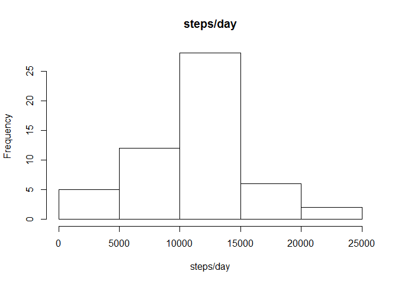
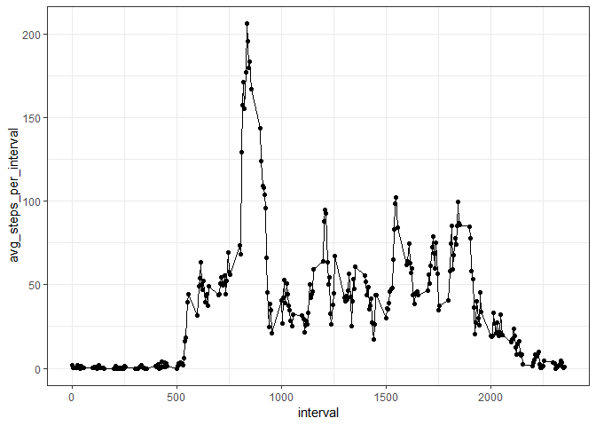
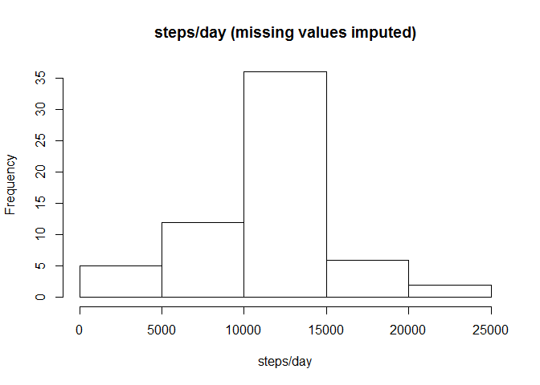
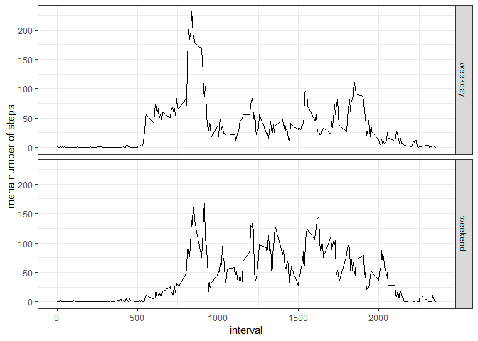

## loading libraries


```r
library(ggplot2)
```

```
## Warning: package 'ggplot2' was built under R version 3.5.1
```

```r
library(dplyr)
```

```
## Warning: package 'dplyr' was built under R version 3.5.1
```

```
## 
## Attaching package: 'dplyr'
```

```
## The following objects are masked from 'package:stats':
## 
##     filter, lag
```

```
## The following objects are masked from 'package:base':
## 
##     intersect, setdiff, setequal, union
```

## Loading and preprocessing the data


```r
download.file("https://d396qusza40orc.cloudfront.net/repdata%2Fdata%2Factivity.zip", destfile = "Reproducibility_week 2.zip")
unzip("Reproducibility_week 2.zip")

data <- read.csv("activity.csv")


data <- transform(data, date = as.Date(date, "%Y-%m-%d")) # transform date to Date format
```

## steps taken per day: histogram, mean and median


```r
data_steps_per_day <- data %>% group_by(date) %>% summarize(steps_per_day = sum(steps))

hist(data_steps_per_day$steps_per_day, xlab = "steps/day", main = "steps/day")
```

<!-- -->


```r
"mean steps per day:"
```

```
## [1] "mean steps per day:"
```

```r
mean(data_steps_per_day$steps_per_day, na.rm = TRUE)
```

```
## [1] 10766.19
```

```r
"median steps per day:"
```

```
## [1] "median steps per day:"
```

```r
median(data_steps_per_day$steps_per_day, na.rm = TRUE)
```

```
## [1] 10765
```

## steps taken per day: time series plot


```r
data_steps_per_interval <- data %>% group_by(interval) %>% summarize(avg_steps_per_interval = mean(steps, na.rm = TRUE))

ggplot(data = data_steps_per_interval, aes( x = interval, y = avg_steps_per_interval)) + 
        geom_point() +
        geom_line() +
        theme_bw()
```

<!-- -->

## 5 minute interval with maximum number of steps on average:


```r
max_steps_per_interval <- max(data_steps_per_interval$avg_steps_per_interval)
data_steps_per_interval$interval[which(data_steps_per_interval$avg_steps_per_interval == max_steps_per_interval)]
```

```
## [1] 835
```

## Imputing missing data


```r
"Number of NAs"
```

```
## [1] "Number of NAs"
```

```r
sum(is.na(data$steps)) 
```

```
## [1] 2304
```

As a strategy to fill in the missing values I decided to use the average of this time interval over different days.


```r
data_imputed <- data

for (i in 1:nrow(data)){   # iterrating through all rows
        
        if (is.na(data_imputed$steps[i])){
               data_imputed$steps[i] <- data_steps_per_interval$avg_steps_per_interval[which(data_steps_per_interval$interval == data_imputed$interval[i])]  # choosing the proper interval and assigning the corresponding mean steps
        }
        
}
```

## steps taken per day with imputed values: histogram, mean and median


```r
data_imputed_steps_per_day <- data_imputed %>% group_by(date) %>% summarize(steps_per_day = sum(steps))

hist(data_imputed_steps_per_day$steps_per_day, xlab = "steps/day", main = "steps/day (missing values imputed)")
```

<!-- -->


```r
"mean total steps per day:"
```

```
## [1] "mean total steps per day:"
```

```r
mean(data_imputed_steps_per_day$steps_per_day)
```

```
## [1] 10766.19
```

```r
"median total steps per day:"
```

```
## [1] "median total steps per day:"
```

```r
median(data_imputed_steps_per_day$steps_per_day)
```

```
## [1] 10766.19
```
The histogram shows an overall similar distribution, but the distribution is less broad with a higher frequency at the mode (10000-15000 steps/day). 

The mean is unchanged which indicates, that the missing values were evenly spaced across the different interval and their lack did not induce an obvious bias (e.g. as if only values at night, in which time only a few steps are recorded, were missing). The median is just slightly changed (1.19 steps per day different than in the non imputed values dataset). Consequently, the imputation reduced the scatter, but had no to very little effect on the mean/median of the distribution, since the values are only imputed we can not be sure, what the real effect of the missing data was, since we just filled it with average data from these intervals, which would only have led to changes in the mean if the missing values were not evenly distributed among the intervals.

## Differences between weekends and weekdays


```r
data_imputed <- data_imputed %>% mutate(type_of_day = ifelse(weekdays(date) %in% c("Samstag", "Sonntag"), "weekend", "weekday")) %>% transform(type_of_day = factor(type_of_day))
```


```r
data_weekend_day_split <- data_imputed %>% group_by(type_of_day, interval) %>%
         summarize(mean_steps = mean(steps))

ggplot(data = data_weekend_day_split, aes(x = interval, y = mean_steps)) +
        geom_line() +
        facet_grid(type_of_day ~ .) +
        ylab("mena number of steps") +
        theme_bw()
```

<!-- -->

